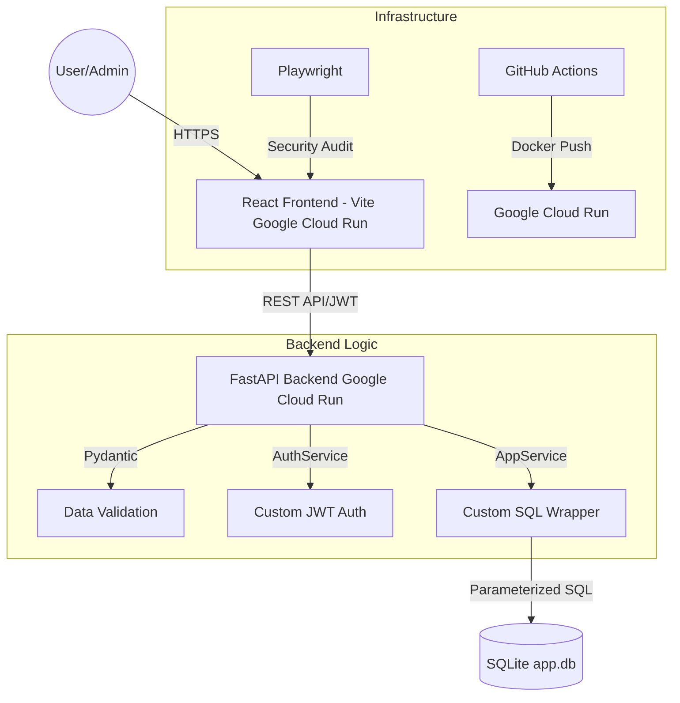

# Rentokil Self-Service Application

A comprehensive, full-stack pest control appointment booking and management system built with modern DevSecOps practices. 

## Assessment Documentation
This project was developed in accordance with the following assessment requirements:
- **Assessment Brief**: [Full Requirements & Rubric](https://docs.google.com/document/u/1/d/1MySvxCN7EyxIJMVyGQhPgtf9AUF4KIZO/edit)
- **Viva Presentation (Component 2)**: [Google Slides Presentation](https://docs.google.com/presentation/d/12jTcNNGxCz2wZ_Gh2gcpnMimd2q6Y1Uhi_rFLm6u4z4/edit)
- **Final Submission**: [End of Module Portfolio Submission](https://canvas.roehampton.ac.uk/courses/example/assignments/example) (Placeholder Link)

---

The repository is structured into three main components:
1. **Frontend**: A responsive React SPA built with Vite.
2. **Backend**: A high-performance Python FastAPI server.
3. **Local Stack**: A unified Docker Compose environment for seamless local development and automated security auditing.

---

## Architectural Overview

The Rentokil Self-Service application follows a decoupled, three-tier architecture designed for scalability and security.

### System Architecture Diagram


### Architectural Layers
- **Presentation Layer (Frontend)**: A modern React Single Page Application (SPA). It manages user state, handles client-side routing, and enforces immediate UI-level validation.
- **Application Layer (Backend)**: A Python FastAPI service that acts as the secure gateway. It handles business logic, implements Role-Based Access Control (RBAC), and sanitizes all incoming requests using Pydantic schemas.
- **Security & Identity**: A bespoke authentication layer (`CaesarJWT`) handles the generation and verification of tokens, while custom middleware ensures HTTP security headers are correctly set.
- **Persistence Layer (Data)**: The data is managed through a custom Database Access Object (DAO) layer (`CaesarSQLDB`). This layer abstracts the raw SQL operations, ensuring that all database interactions are parameterized and immune to injection attacks.
- **DevOps & Infrastructure**: The entire stack is containerized using Docker. The deployment pipeline (GitHub Actions) treats infrastructure as code, automating the transition from local development to the Google Cloud Run serverless environment.

---

---

## Software Development Life Cycle (SDLC) Approach

This project followed a modern, iterative SDLC approach integrated with DevOps principles:

- **1. Planning**: Requirements were defined based on the Rentokil business case, focusing on appointment lifecycle management and secure customer data handling.
- **2. Design**: A microservices-ready architecture was designed using React for the UI and FastAPI for the backend. Database schemas were normalized for SQLite as a Proof of Concept (PoC).
- **3. Development**: Code was developed in modular sprints. Backend logic utilized custom proprietary modules (`CaesarSQLDB`, `CaesarJWT`) to ensure full control over security and data abstraction.
- **4. Testing (Shift-Left)**: Quality and security testing were integrated from the start. This included PyTest for backend logic and a custom Playwright suite for automated security audits (OWASP Top 10).

---

## Key Features

### Frontend Features (React + Vite)
- **User Authentication**: Secure JWT-based login and registration flows managed via `AuthForms.jsx`.
- **Interactive Dashboard**: A unified `Dashboard.jsx` interface where users can view and manage their upcoming appointments.
- **Booking Interface**: Rigorous form validation enforcing strict UK Postcode structural shapes alongside required address fields (Door Number, Road Name).
- **Admin Portal**: Elevated access built directly into the UI for administrators to review and update all global appointment statuses.
- **Usability & Feedback**: The application provides real-time feedback through success/failure messaging (e.g., "Booking Confirmed!"). Per assessment requirements, a **confirmation prompt** is triggered before deleting/cancelling any appointment to prevent accidental data loss.
- **Security by Default**: Utilizes React's auto-escaping to inherently prevent Cross-Site Scripting (XSS) within user-provided appointment notes.

### Backend Features (FastAPI + Python)
- **RESTful API**: Fast, self-documenting API endpoints using Swagger UI.
- **Custom Proprietary Modules**: Leverages bespoke, custom-built libraries unique to this project, including `CaesarSQLDB` for secure database abstraction, `CaesarJWT` for custom token management, and `caesaraiunit.py` for specialized test handling.
- **Data Integrity**: Strict Pydantic models for request/response schema validation, ensuring only conformant data enters the system.
- **Secure Database Operations**: Utilizes parameterized queries (via the `psycopg.sql` module and `CaesarSQLDB` layer) to systematically neutralize SQL Injection attacks.
- **Role-Based Access Control (RBAC)**: Enforces boundaries between standard users and administrators.
- **SQLite Database (PoC)**: Uses an `app.db` SQLite file as a lightweight, serverless-compatible Proof of Concept for data persistence.

---

## Security, Code Coverage & Pentesting

Security is a first-class citizen in this project, adopting a "Shift-Left" DevSecOps methodology:

- **OWASP Top 10 Pentesting (Playwright)**: The project features a custom E2E penetration testing suite built with **Playwright**. It automatically simulates real-world attacks (SQLi, XSS, SSRF, Broken Access Control) against the UI and API, generating video and screenshot evidence of the app defending itself.
- **Code Quality & Unit Testing**: The backend is heavily tested using **PyTest**, with high code coverage metrics ensuring business logic reliability.
- **Vulnerability Scanning**: CI/CD pipelines integrate **Trivy** to scan Docker images and **Bandit** to analyze Python code for known vulnerabilities and outdated components prior to deployment.

### Automated Security Audit Results (10/10 OWASP Top 10)

The following table summarizes the automated penetration tests executed via Playwright and their results:

| Category | Vulnerability | Attack Methodology | Defensive Result |
| :--- | :--- | :--- | :--- |
| **A01:2021** | Broken Access Control | Attempted IDOR (Insecure Direct Object Reference) to delete another user's appointment via direct API request. | **PASSED**: System returned **403 Forbidden**. |
| **A02:2021** | Cryptographic Failures | Inspected registration/login API responses for leaks of sensitive fields (password hashes, plain text). | **PASSED**: Sensitive fields were **Undefined** in responses. |
| **A03:2021** | Injection (SQLi) | Inputted `' OR '1'='1` tautology into login fields to bypass authentication. | **PASSED**: Access denied; Treated as literal string. |
| **A03:2021** | Injection (XSS) | Injected `` into appointment notes to attempt script execution. | **PASSED**: Sanitized/Escaped by React; No script execution. |
| **A04:2021** | Insecure Design | Attempted account enumeration by analyzing error message differences between valid and invalid users. | **PASSED**: Unified generic error messages provided. |
| **A05:2021** | Security Misconfig | Attempted to gain access using default system credentials (`admin/admin`). | **PASSED**: Default credentials disabled/rejected. |
| **A06:2021** | Vulnerable Components | Inspected HTTP headers for "Server" or "X-Powered-By" version leakage. | **PASSED**: Headers suppressed via Uvicorn configuration. |
| **A07:2021** | Auth Failures | Verified session destruction and `localStorage` clearing upon user logout. | **PASSED**: Token successfully cleared; session invalidated. |
| **A08:2021** | Data Integrity | Injected malformed data types (e.g., strings in date fields) into API requests. | **PASSED**: Pydantic schema rejected data with **422**. |
| **A10:2021** | SSRF | Attempted to inject internal URLs (`http://localhost:8080/admin`) into address fields. | **PASSED**: Blocked by strict structural regex validation. |

*Full visual evidence (videos and screenshots) of these tests can be found in the `RentokilSelfServiceFrontendUni/Pentest/` directory.*

---

## CI/CD Pipeline & GitHub Actions

The entire lifecycle is automated using **GitHub Actions**. The pipeline is branch-driven and automatically provisions, tests, and deploys the application:

### Environment Strategy
The system utilizes three distinct environments linked to GitHub branches:
1. **Dev Environment** (Branch: `dev`): For active development and integration testing.
2. **Test Environment** (Branch: `test`): For QA and automated E2E/Security validation.
3. **Production Environment** (Branch: `main`): The live, stable release.

### Secrets Management
- **Local Dev**: Development secrets (like local JWT keys) are injected via `.env` files (which are strictly ignored by Git).
- **Production/CI**: Secrets are securely managed via **GitHub Actions Secrets**. The deployment workflows dynamically inject these secrets (e.g., `JWT_SECRET_KEY`) into the Google Cloud Run environment variables at deployment time.

---

## Cloud Deployment (Google Cloud Run)

Both the frontend and backend are containerized via Docker and deployed to **Google Cloud Run** for a fully serverless, auto-scaling architecture. 

*Note: For this Proof of Concept, the backend utilizes a relative SQLite database (`sqlite:///app.db`). Cloud Run natively mounts a writable filesystem for the container lifecycle, allowing the database to function without requiring an external Cloud SQL instance.*

### Live URLs

#### 🟢 Production (`main`)
- **Frontend**: https://rentokil-frontend-uni-prod-662756251108.europe-west1.run.app
- **Backend**: https://rentokil-backend-uni-prod-662756251108.europe-west1.run.app

#### 🟡 Test (`test`)
- **Frontend**: https://rentokil-frontend-uni-test-662756251108.europe-west1.run.app
- **Backend**: https://rentokil-backend-uni-test-662756251108.europe-west1.run.app

#### 🟠 Development (`dev`)
- **Frontend**: https://rentokil-frontend-uni-dev-662756251108.europe-west1.run.app
- **Backend**: https://rentokil-backend-uni-dev-662756251108.europe-west1.run.app

---

## Architectural Decisions: Excluded Technologies

Throughout the development of this project, several legacy or redundant DevOps tools were consciously evaluated and excluded to maintain a modern, lean, and efficient architecture:

- **Puppet**: Puppet is a legacy configuration management tool designed for provisioning physical or virtual servers. Because this application is deployed to **Google Cloud Run**, the infrastructure is entirely "Serverless." The `Dockerfile` serves as the sole middleware automation layer, defining the exact immutable environment needed. Consequently, Puppet would have been obsolete.
- **Terraform**: While Terraform is the industry standard for Infrastructure as Code (IaC), it was deemed unnecessary for this specific Proof of Concept. **GitHub Actions** heavily abstracted the deployment process. The only manual infrastructure step required was executing a simple `.sh` script to create a single Google Cloud Service Account; GitHub Actions handled the subsequent automated provisioning of Cloud Run services dynamically.
- **A-A-P**: A-A-P is a legacy Python build automation tool. Because the project leverages **Docker**, the "build" step is inherently automated and standardized. Introducing A-A-P would have resulted in severe over-engineering with outdated technology.
- **GitLab CI**: While GitLab offers a powerful CI/CD ecosystem, the project utilized **GitHub Actions**. GitHub natively integrates with the repository source code and provides identical automation capabilities for Cloud Run deployments, removing the need to migrate to a different SCM and CI platform.

---

## How to Run Locally

The `RentokilLocalStackUni` directory contains a unified build script to manage the local Docker environment.

### Prerequisites
- Docker & Docker Compose
- Node.js (for local Playwright execution)

### 1. Run the Development Server
Build and start both the Frontend and Backend locally:
```bash
./build_app.sh --local
```
- **Frontend**: http://localhost:5173
- **Backend API**: http://localhost:8080
- **API Docs**: http://localhost:8080/docs

### 2. Run the Full Test Suite
Run Backend Pytest units and Frontend E2E tests:
```bash
./build_app.sh --test
```

### 3. Run the OWASP Security Audit
Launch the automated Playwright penetration test suite to generate security evidence:
```bash
./build_app.sh --pentest
```
*Evidence (videos and screenshots) will be saved to `RentokilSelfServiceFrontendUni/Pentest/`.*

---